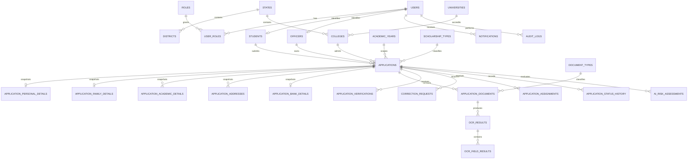

# PMSSS Entity Relationships

## Core relationships

## Table inventory

| Area | Tables |
| --- | --- |
| Master data | `academic_years`, `scholarship_types`, `document_types`, `states`, `districts`, `universities`, `colleges` |
| Identity | `users`, `roles`, `user_roles`, `students`, `officers` |
| Student profile | `student_addresses`, `student_family_details`, `student_academic_details`, `student_bank_details` |
| Application | `applications`, `application_personal_details`, `application_family_details`, `application_academic_details`, `application_addresses`, `application_bank_details` |
| Documents and OCR | `application_documents`, `ocr_results`, `ocr_field_results` |
| Workflow | `application_verifications`, `document_verification_history`, `correction_requests`, `application_assignments`, `application_status_history` |
| Supporting services | `ai_risk_assessments`, `notifications`, `audit_logs` |

## Design decisions

- `applications` references the student profile but stores submitted values in application snapshot tables so later profile edits do not rewrite history.
- A student may submit multiple applications across academic years and scholarship types; the composite uniqueness rule prevents duplicate applications for the same combination.
- Documents reference external Cloudinary objects, not binary document content.
- OCR is one-to-many from documents so reprocessing can retain prior results.
- Verification, correction, assignment, and status history are append-oriented records; current state remains on the owning record for efficient queue queries.
- AI risk is advisory data only. The schema has no AI action that can automatically reject an application.